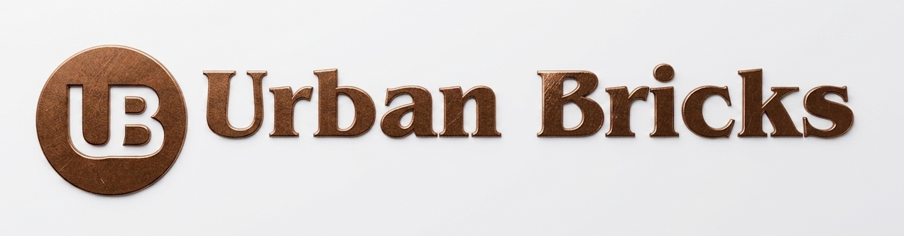

<p align="center">
  
</p>

<h1 align="center">Urban Bricks</h1>

<p align="center">
  <strong>A Real Estate Complete Solution — Ambikapur, Surguja, Chhattisgarh</strong>
</p>

<p align="center">
  <a href="https://urbanbricks.in">Live Website</a> &nbsp;·&nbsp;
  <a href="https://wa.me/919810864670">WhatsApp</a> &nbsp;·&nbsp;
  <a href="https://www.instagram.com/urbanbricks043">Instagram</a> &nbsp;·&nbsp;
  <a href="https://www.facebook.com/114082557010792/">Facebook</a>
</p>

---

## About

**Urban Bricks** is a premium real estate website for a property solutions company based in Ambikapur, Surguja (Chhattisgarh). It covers residential, commercial, agricultural, and construction & design services — all under one roof.

---

## Tech Stack

| Technology | Purpose |
|---|---|
| React 19 | UI Library |
| Vite 8 | Build Tool |
| Framer Motion | Animations |
| Lucide React | Icons |
| Google Fonts | Typography (Cormorant Garamond + Jost) |
| ESLint 10 | Code Linting |

---

## Features

- **Dark Mode / Light Mode** with theme toggle and preference saved in local storage
- **Animated Preloader** with 3D building construction intro and skip button
- **3D CSS Illustrations** — Building, Villa, Residential, Commercial, Agriculture, and Design scenes (pure CSS, no WebGL)
- **Glassmorphic Navbar** with scroll progress bar and mobile hamburger menu
- **Smooth Scroll Navigation** across sections (Home, About, Services, Contact)
- **Animated Hero Section** with headline reveal, counter stats, and dual CTA buttons
- **14 Services** organized in 4 categories (Residential, Commercial, Agriculture, Construction & Design) with tab switching and detail modals
- **3D Showcase Panel** that changes per service category
- **3D Tilt Cards** on hover for service cards
- **WhatsApp Integration** — Enquiry form auto-generates a pre-filled WhatsApp message and opens chat directly
- **WhatsApp Floating Button (FAB)** — Fixed bottom-right button with automated greeting message
- **Contact Form** with client-side validation (Name & Mobile required)
- **Contact Person Card** — Chandan Soni with direct WhatsApp quick-chat
- **Google Review Card** — One-click link to leave a Google review
- **Interactive Map Card** with animated pin linking to Google Maps office location
- **Founder Profile Section** with photo, bio, and 16+ years experience badge
- **Brand Logo Marquee** — Auto-scrolling carousel of 16 brand collaborations (Zudio, Lenskart, ICICI Bank, Apollo Pharmacy, Cantabile, Mufti, etc.)
- **Social Links** — WhatsApp, Facebook, Instagram integrated in footer and contact section
- **Newsletter CTA** in footer with email input
- **Back to Top Button**
- **Blueprint Grid Overlay** and floating ambient particles for visual depth
- **Day/Night Sky** with animated stars, moon, sun, and clouds based on theme
- **Animated Counters** — 10k+ Properties Dealt, 11 Services Offered, Trusted Since Day One
- **Scroll-triggered Animations** — Fade-up entrances on all sections
- **Fully Responsive** — Works on mobile (320px) to desktop (4K)
- **Custom Scrollbar** styled to match the theme
- **SEO Optimized** — Meta description, proper title tags, and semantic HTML

---

## Services Covered

| Residential | Commercial | Agriculture | Construction & Design |
|---|---|---|---|
| Residential Flat | Commercial Office / Space | Agricultural Land / Plots | Home Plan |
| Residential Land | Commercial Shop / Showroom | Agro-Forestry / Orchards | 2D / 3D Elevation |
| Farm House | Commercial / Industrial Plots | Greenhouse / Polyhouse | Elevation & Layout Design |
| | | | Interior Design |
| | | | Structural Construction |

---

## Project Structure

```
Urban Bricks/
├── public/
│   ├── brands/              # Brand collaboration logos
│   ├── favicon.png
│   ├── favicon.svg
│   └── icons.svg
├── src/
│   ├── assets/              # Images (logo, founder photo)
│   ├── UrbanBricks.jsx      # Main application component
│   ├── main.jsx             # Entry point
│   ├── index.css            # Base styles
│   ├── App.jsx              # Default Vite app (unused)
│   └── App.css              # Default Vite styles (unused)
├── index.html
├── vite.config.js
├── package.json
├── eslint.config.js
└── README.md

```

---

## License

This project is proprietary. All rights reserved by **Urban Bricks**.

---

<p align="center">
  <sub>Built with React + Vite + Framer Motion</sub>
</p>
